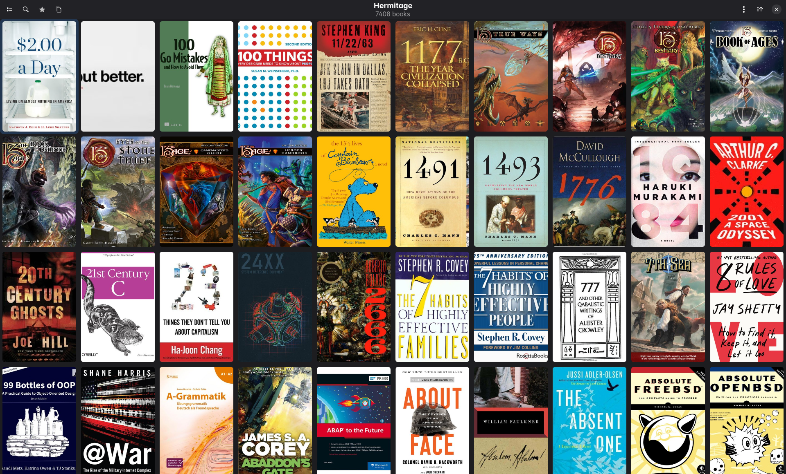

<p align="center">
  
</p>

<p align="center">
  <a href="https://www.python.org/"></a>
  <a href="LICENSE"></a>
</p>

---

<p align="center">
  
</p>

# Hermitage

A visually immersive, local-first media sanctuary for Calibre libraries. Native GTK 4 application, Hyprland-native and equally at home under GNOME, designed to make browsing a 4,000+ item library feel like walking through a curated gallery.

## Why this exists

Calibre is the gold standard for ebook management, but its UI is built for librarians, not readers. Hermitage is built for the single user who wants a modern, native desktop experience without the overhead of Docker containers or web-based authentication layers. It reads your existing `metadata.db` directly (read-only) and presents your collection as a high-performance, cinematic gallery.

## Features

| Feature | Description |
|---------|-------------|
| **The Sanctuary** | Edge-to-edge cover art grid with hover scale transforms and dynamic color tinting. |
| **The Codex** | Sliding detail sidebar with hero banners, clickable metadata, native Calibre page counts, authors ordered by their true sort keys (with author links), enumeration values colored per your desktop GUI's palette, half-star ratings, and — for multi-format books — a format picker beside the Read button (EPUB/PDF/CBZ; open the one you mean). |
| **Genre Browser** | Recursive tag hierarchy rendered as nested cards and pills. |
| **Virtual Libraries** | Native support for Calibre's **Virtual Libraries** (Wings) for instant filtering — ordered and hidden exactly as your Calibre GUI arranges them. |
| **Saved Searches** | Calibre's named saved searches appear in the sidebar; one click runs the query via cquarry's grammar engine. |
| **User Categories** | Calibre's hand-built tag-browser categories appear as a third sidebar section; one click searches them through cquarry's native `@Name` location (Calibre-exact member semantics). |
| **Annotations & Reading Progress** | E-reader highlights and per-device progress from Calibre's own sync surface on each detail page. |
| **Local-First** | Zero telemetry, zero network calls, zero accounts. Just your books. |

## Development & Setup

Hermitage's own code runs on Python 3.13, but installs need **Python 3.14+**: its data layer is [cquarry](https://github.com/VirInvictus/cquarry), whose releases require 3.14 (pip enforces this before anything runs). GTK 4.22+ is also required.

```bash
# Install dependencies
pip install PyGObject Pillow PyYAML cquarry

# Run first-run wizard
python -m hermitage
```

A Flatpak manifest (`data/io.github.virinvictus.hermitage.yml`, GNOME 50 runtime) ships in the repo; it bundles its own pinned cquarry, and Flathub submission is planned.

### Library verification

`hermitage-verify` is a standalone CLI that validates every book's directory path and cover resolution against the catalog (books whose catalog row lists no format are reported; it does not stat format files on disk, and png-only covers count as missing by design). It also benchmarks path resolution time.

## Tag structure

Hermitage uses Calibre's tag system as a genre hierarchy. Tags with dot-separated names are parsed into a navigable tree in the genre browser. The deeper your tag structure, the richer the browsing experience:

```
Fic.Fantasy.Epic          -> Fic > Fantasy > Epic
Fic.Fantasy.Grimdark      -> Fic > Fantasy > Grimdark
Gaming.TTRPG.OSR          -> Gaming > TTRPG > OSR
Gaming.TTRPG.OSR.Megadungeon -> Gaming > TTRPG > OSR > Megadungeon
NonFic.History.Military    -> NonFic > History > Military
```

Top-level categories appear as cards. Mid-level branches appear as labeled subsections. Leaf genres appear as clickable accent-colored pills with book counts. Every level is clickable and filters the grid. If your Calibre tags are flat (no dots), the genre browser still works: each tag appears as its own card.

## Requirements

**Python 3.14+** (see the note under Development & Setup) with:

```
pip install PyGObject Pillow PyYAML cquarry
```

**System libraries:**

- GTK 4.22+
- GObject Introspection

```bash
# Fedora 43+
sudo dnf install gtk4 python3-gobject

# Arch
sudo pacman -S gtk4 python-gobject
```

## Usage

```bash
# Run directly
python -m hermitage

# Or install and run via console script
pip install -e .
hermitage
```

On first run, Hermitage will prompt you to select your Calibre library directory. Settings are stored in `~/.config/hermitage/config.yaml` and can be edited in any text editor or through the in-app preferences page.

To override the library path via environment variable:

```bash
export HERMITAGE_DB="/path/to/your/Calibre Library/metadata.db"
```

## Search syntax

The search bar (Ctrl+F) supports Calibre's full query language:

```bash
# Field-specific search
tags:Fantasy
title:"The Lord of the Rings"
authors:Tolkien
series:Discworld
formats:EPUB
rating:5

# Exact match (= prefix inside quotes)
tags:"=Fic.Fantasy"

# Boolean operators
tags:Fantasy and not tags:Romance
(tags:SciFi or tags:Fantasy) and rating:5

# Virtual library references
vl:"Fantasy Wing"
```

Bare text searches across title, authors, tags, series, formats, languages, and custom columns. Multiple words are implicitly ANDed.

## Keyboard shortcuts

| Shortcut | Action |
|----------|--------|
| Ctrl+F   | Toggle search bar |
| Ctrl+L   | Toggle virtual library sidebar |
| Ctrl+G   | Toggle genre browser |
| Ctrl+R   | Toggle series browser |
| Ctrl+I   | Library Insights window |
| Ctrl+comma | Preferences |
| Ctrl+?   | Keyboard shortcuts overlay |
| Ctrl+Q   | Quit |
| Escape   | Dismiss codex, then search, then VL sidebar (priority order) |

## Library verification

```bash
hermitage-verify
```

Standalone CLI that validates every book's directory path and cover resolution, reports issues grouped by category, and benchmarks path resolution time. (See the note under Development & Setup for what "validated" means per check.)

## Architecture

```
hermitage/
  __init__.py       # Version single-source (__version__)
  __main__.py       # Entry point + SIGINT handler
  app.py            # Gtk.Application, GridView, overlay-revealer sidebars, sorting, search, type-ahead
  widgets.py        # Owned GTK widgets: Clamp, WindowTitle, ToastOverlay, StatusPage, boxed-list rows
  theme.py          # Single theme path: portal dark/light + Kanagawa Dragon palette
  typography.py     # Bundled fonts (Fraunces, Inter, IBM Plex Sans Condensed) registered with Pango at startup
  codex.py          # Detail sidebar: hero blur, clickable metadata, synopsis, Read button
  config.py         # YAML config load/save (~/.config/hermitage/config.yaml)
  genres.py         # Genre browser: recursive tag hierarchy with cards and pills
  series.py         # Series browser: grouped rows with index ranges and gaps
  history.py        # Reading history: one event-log table, newest-first view
  insights.py       # Library Insights window: glance tiles, top-N, audit rows
  export.py         # JSON/CSV library export via a file dialog
  preferences.py    # Plain Gtk.Window preferences (boxed-list, dropdown, switch)
  wizard.py         # First-run setup wizard with Calibre folder picker
  database.py       # Thin cquarry wrapper: library load, VL/saved-search state, JIT comment reads
  thumbnailer.py    # Per-scale thumbnail disk cache + 512-entry in-memory texture LRU
  colors.py         # Median-cut color quantization, vibrancy sorting, three-tier cache
  verify.py         # CLI library integrity checker
  style.css         # Owned application stylesheet (grid, codex, adwaita-class successors)
```

## Stack

- **Python 3.14+** for installs, per the cquarry floor (see Development & Setup); Hermitage's own code is 3.13-compatible
- **GTK 4.22** (no libadwaita) -- plain GTK 4 with an owned stylesheet, Hyprland-native; overlay `Gtk.Revealer` sidebars, a width-clamping widget, and portal-based follow-system dark/light in place of the adwaita equivalents
- **cquarry** -- the shared Calibre reading engine; the read-only guarantee is enforced there (every connection opens through cquarry's read-only URI), and Hermitage never writes anything it reads
- **SQLite3** -- Calibre's `metadata.db`, read exclusively through cquarry
- **Pillow** -- thumbnailing (LANCZOS), hero blur (GaussianBlur r30), color quantization (median-cut)
- **PyYAML** -- config file at `~/.config/hermitage/config.yaml`
- **Thread pools** -- 4 threads for thumbnails/colors, 2 threads for hero blur generation
- **Cached assets** in `~/.cache/hermitage/` -- `thumbs/`, `colors/`, `blur/`

## Support

If Hermitage's useful to you and you'd like to chip in:

- liberapay · [liberapay.com/bdkl](https://liberapay.com/bdkl/)
- bitcoin
  ```
  bc1qkge6zr45tzqfwfmvma2ylumt6mg7wlwmhr05yv
  ```
